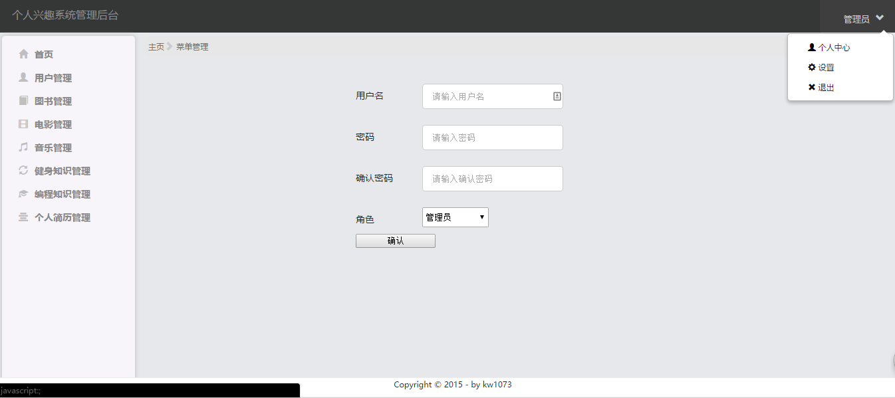

## 一、项目架构
#### 1、项目结构
```
project_demo
├── bin                                    # 项目安装部署脚本
│   └── install-ctl
├── etc                                    # 项目所有的配置都从这里配置，包括django的settings.py配置
│   ├── config.yaml
│   └── config.yaml.template
├── project_demo                           # 名称与顶层目录一致
│   ├── apps                               # 用来扩展之后的app代码
│   │   └── app_demo           
│   │       ├── for_mock.py
│   │       ├── models.py
│   │       ├── urls.py
│   │       └── views.py
│   ├── manage.py
│   ├── settings                           # django的settings文件
│   │   ├── base.py                        # 基础配置（一般不修改）
│   │   ├── develop.py.template            # develop.py.template为开发者配置，开发者需要拷贝一份模板文件进行配置
│   │   ├── product.py                     # product为生产配置（一般不修改）
│   │   └── test.py                        # UT配置（一般不修改）
│   ├── templates                          # 前端模板文件
│   │   ├── apps                           # 模板根据apps里面的app分开存放
│   │   │   └── app_demo
│   │   ├── includes                       # app可能会引用的，如ajax动态生成的或者公共的模板提取
│   │   │   └── model_for_app_demo.html
│   │   └── index.html
│   ├── tests                              # 用于存放单元测试的目录
│   │   └── app_demo                       # 根据apps目录分开
│   │       ├── test_mock.py
│   │       └── test_views.py
│   ├── urls.py
│   ├── utils                              # 存放公共方法或者类
│   │   ├── config.py                      # 项目统一配置入口
│   │   ├── exception.py
│   │   ├── singleton.py
│   │   └── thirdparty
│   └── wsgi.py
├── README.md
└── site-packages                          # 项目依赖第三方包，开发人员需要在requirementss.ini中注明类型和版本
    └── requirements.ini                   
```


#### 2、配置读取
```
from utils.config import Config
Config.get('etc下的配置文件名', '关键字', default='默认值')
```
###### settings/product.py例子
```
MYSQL_CONFIG = Config.get('config', 'mysql')

EXTRA_DATABASE = {
    'legacy': {
        'ENGINE': 'django.db.backends.mysql',
        'HOST': MYSQL_CONFIG.get('legacy').get('host'),
        'PORT': MYSQL_CONFIG.get('legacy').get('port'),
        'NAME': MYSQL_CONFIG.get('legacy').get('db'),
        'USER': MYSQL_CONFIG.get('legacy').get('user'),
        'PASSWORD': MYSQL_CONFIG.get('legacy').get('password'),
        'OPTIONS': {
            'init_command': 'SET storage_engine=INNODB',
        },
    },
    'external_storage': {
        'ENGINE': 'django.db.backends.mysql',
        'HOST': MYSQL_CONFIG.get('external_storage').get('host'),
        'PORT': MYSQL_CONFIG.get('external_storage').get('port'),
        'NAME': MYSQL_CONFIG.get('external_storage').get('db'),
        'USER': MYSQL_CONFIG.get('external_storage').get('user'),
        'PASSWORD': MYSQL_CONFIG.get('external_storage').get('password'),
        'OPTIONS': {
            'init_command': 'SET storage_engine=INNODB',
        },
    },
}
```

##### 3、UT命令
```
# 运行并统计测试
coverage run --source='apps,utils' {project..}/manage.py test --settings=settings.test --with-doctest --with-xunit --xunit-file='test.xunit' --logging-level=ERROR

# 输出统计结果
coverage report --omit='*/__init__*,*/urls*'
```

## 二、项目页面

#### 1、主页

